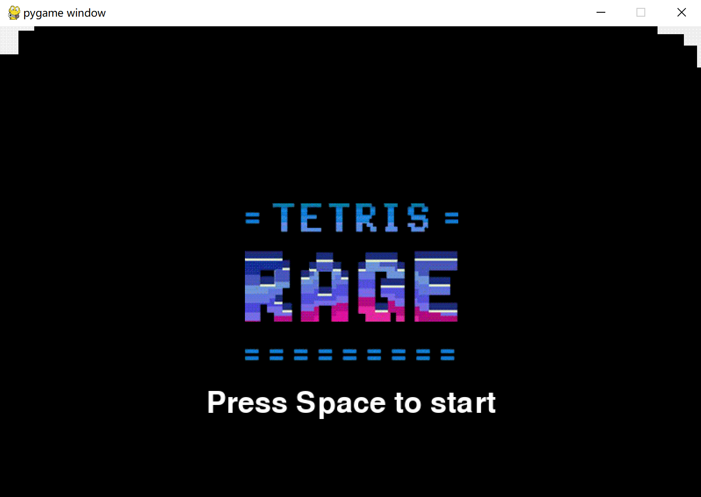

# Tetris - a Micro Pygame
**Demonstration:** 

**Introduction**

This project aims to develop a Tetris game, providing players with the classic Tetris gaming experience. Tetris is a classic puzzle game where players control different shapes of blocks, called tetrominos, to move them vertically or rotate them to fill complete horizontal lines. When a line is completed, it disappears, and the player earns points. The game's difficulty increases as more lines are cleared, until the game area is filled, or the player cannot move the falling tetrominos anymore.

## Graphical Abstract

## How to operate?

- **Left and right movement control:** use the left and right direction keys of the keyboard to achieve(⬅)(⮕)
- **Rotation direction control:** use the up keys of the keyboard to achieve(⬆)
- **Fast fall control** use the down keys of the keyboard to achieve(⬇)

## Purpose of the software

The purpose of our software is to develop a high-quality Tetris game. Tetris is a classic puzzle game where players must arrange falling blocks of different shapes to create complete rows. Our goal is to provide an engaging and enjoyable gaming experience for users, capturing the essence of the original game while incorporating modern features and enhancements.
Architecture Approach: ***High-Quality + Waterfall***

For the development of our Tetris game, we have adopted a high-quality approach combined with the waterfall model. The high-quality approach ensures that our software meets the highest standards of functionality, usability, performance, and reliability. We prioritize robust code, efficient algorithms, and an intuitive user interface to deliver a seamless and enjoyable gaming experience.

The waterfall model provides a structured framework for the development process. It involves distinct phases, including requirements gathering, design, implementation, testing, and deployment. This sequential approach allows for careful planning, thorough documentation, and well-defined milestones, ensuring that each stage is completed before moving to the next. By following the waterfall model, we aim to deliver a polished and error-free Tetris game that meets the specified requirements and exceeds user expectations.

## Development Plan

### Development Process

#### Phase One: Environment Setup and Basic Functionality Implementation

1. **Environment Setup**
   - *Download and install Python 3.x and set up a code editor.*
   - *Proper installation of Python and code editor is crucial for seamless development.*

2. **Pygame Configuration**
   - *Install and configure the Pygame library.*
   - *Pygame setup is essential for graphics and event handling.*

3. **Window Initialization**
   - *Initialize the game window with appropriate settings.*
   - *Proper window initialization ensures a smooth user interface.*

4. **Block Display**
   - *Implement rendering of different tetrominos.*
   - *Rendering blocks accurately is essential for gameplay.*

5. **Block Movement**
   - *Implement movement and rotation of tetrominos.*
   - *Smooth movement and rotation enhance player control.*

6. **Collision Detection**
   - *Implement collision detection between tetrominos.*
   - *Accurate collision detection ensures fair gameplay.*

7. **Line Clearing**
   - *Implement logic for clearing completed lines.*
   - *Line clearing is a core mechanic for scoring and progression.*

#### Phase Two: Game Functionality Enhancement and Optimization

1. **Tetromino Rotation Optimization**
   - *Improve rotation mechanics for tetrominos.*
   - *Smooth rotation enhances gameplay fluidity.*

2. **Game Interface Beautification**
   - *Enhance visual elements of the game interface.*
   - *A visually appealing interface improves user experience.*

3. **Sound Effects Addition**
   - *Integrate sound effects for game events.*
   - *Sound effects add immersion and feedback to gameplay.*

4. **Pause**
   - *Add functionality for pausing and saving the game state.*
   - *Pausing and saving improve user convenience.*

5. **User Interface Enhancement**
   - *Improve user interaction elements.*
   - *Clear instructions and intuitive controls enhance usability.*

### Members

Hanson (P2211630)

* **Project Manager** (make development plan)
* **Main programmer** (solve problems in game running, develop basic logic of the game and set an initial cover)
* Create Variable Table and Requirement Table for code development
* Help write README.md

Richard (P2211590) 

* **Repository manager**
* **Main programmer** (develop basic logic of the game)
* Help write README.md

Bless (P2211527)

* **Main programmer** (develop basic class - block.py, blockType.py)
* **Test controller** (test the problem of the game)
* Help write README.md

Kaylee (P2211433)

* **Programmer** (write const.py, one of basic class file aggregated all of materials)
* **Test controller** (test the problem of the game)
* Help write README.md

### Schedule

**2.21 - 3.6:** Negotiating and deciding what to do and planning initially

**3.7 - 4.9:** Developing, coding, testing and problem solving

**4.9 - 4.14:** Writing README document and recording videos

**4.14 - 4.20:** Final check of the project

### Algorithm

We Divide blocks into several groups to handle all of the status:
  * Single Block: With rotate(), moveLeft(), moveRigh()t, isLeftBoundary(), isRightBoundary() and etc. , we can easily handle the status of single block in the game.
  * Block Group: One shape of 4 blocks is a block group. We set up basic keyboard controls for its operations. For the rotation, we firstly set up every shape the block group will be in the const.py, then we can easily use them with the index to handle the operation.
  * Fixed Block Group: We use a list to record every time the fixed block group will be like.
  * Block Elimination: We simply use lists to record the row of blocks that should be eliminated, then it will be replaced with an empty list. 
  * Block Collision: We use a hash table to handle it. It firstly get all of the information about current block groups. If the index is found in the hash table, or the current row that one of the block in is larger or equal than the row of game, it indicates there is a collision.
  * Game logic: It always needs a infinite loop to run. Then we use many boolean values to handle current status of the game.

### Current Status of Our Software

* Basic Tetris gameplay: left and right movement, rotation, block drop, rows elimination, etc.
* Pause and restart
* Remarkable cover

### Future Plan

* Make archived files to store current status of the game
* Develop level mode and infinity mode for challenging

## Development and Runtime Environment, Language, and Minimum System Requirements

### Development Environment:

- Python 3.x
- Pygame
- Visual Studio Code or any other code editor

### Runtime Environment:

- Operating System: Windows, MacOS, Linux, etc.
- Python 3.x runtime environment
- Pygame library

### Language:

- Python

### Minimum System Requirements:

- CPU: 1 GHz or more powerful processor
- Memory: 1 GB RAM at least
- Graphics Card: OpenGL 2.0 compatible
- Storage: At least 100 MB available space

***Ensure the required environment is set up correctly, and minimum system requirements are met to ensure optimal gameplay experience.***

## Declaration:

All image and sound effect resources are not produced from us (except the background image)

* image resources are from google

* [sound effect resources](https://www.aigei.com/s?type=sound&q=%E4%BF%84%E7%BD%97%E6%96%AF%E6%96%B9%E5%9D%97&dim=is_vip_false)
